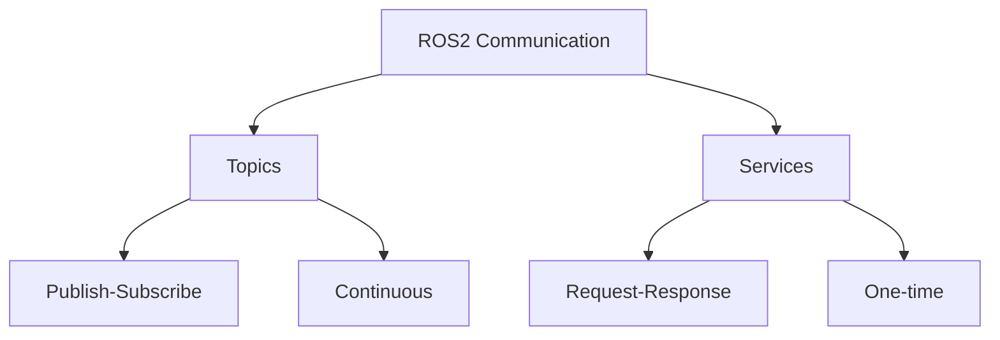

# ROS2 Hands-on Guide: Topics and Services

## Topic Operations

### Command Line Interface (CLI) Methods

#### **1. Single Publication**
```bash
ros2 topic pub -1 /turtle1/cmd_vel geometry_msgs/msg/Twist "
linear: {x: 1.0, y: 0.0, z: 0.0}
angular: {x: 0.0, y: 0.0, z: 0.0}
"
```

#### **2. Continuous Publication (10Hz)**
```bash
ros2 topic pub --rate 10 /turtle1/cmd_vel geometry_msgs/msg/Twist "
linear: {x: 1.0, y: 0.0, z: 0.0}
angular: {x: 0.0, y: 0.0, z: 0.5}
"
```

#### **Common Movement Commands**
| Action          | Linear (x,y,z) | Angular (x,y,z) |
|-----------------|----------------|-----------------|
| Move Forward    | 1.0, 0.0, 0.0  | 0.0, 0.0, 0.0   |
| Turn Left       | 0.5, 0.0, 0.0  | 0.0, 0.0, 0.5   |
| Stop            | 0.0, 0.0, 0.0  | 0.0, 0.0, 0.0   |

#### **Monitoring Topics**
```bash
ros2 topic list          # List all active topics
ros2 topic echo /turtle1/cmd_vel  # View topic messages
ros2 topic info /turtle1/cmd_vel  # Get topic metadata
```

### Graphical (rqt) Methods
1. Launch rqt:
   ```bash
   rqt
   ```
2. Navigate to:
   ```
   Plugins → Topics → Message Publisher
   ```
3. Configure:
   - Select `/turtle1/cmd_vel` topic
   - Choose `geometry_msgs/Twist` type
   - Set velocity parameters
   - Enable publishing checkbox

## Service Operations

### CLI Methods

#### **Essential Service Commands**
```bash
ros2 service list                  # List available services
ros2 service type /spawn           # Show service type
```

#### **Common Service Calls**
| Service          | Command |
|------------------|---------|
| Spawn Turtle     | `ros2 service call /spawn turtlesim/srv/Spawn "{x: 5.0, y: 5.0, theta: 0.0, name: 'turtle2'}"` |
| Reset Simulation | `ros2 service call /reset std_srvs/srv/Empty` |

### Graphical (rqt) Methods
1. Launch rqt:
   ```bash
   rqt
   ```
2. Navigate to:
   ```
   Plugins → Services → Service Caller
   ```
3. Operation:
   - Select desired service (e.g., `/spawn`)
   - Fill request parameters
   - Click "Call" button

## Visual Representation


